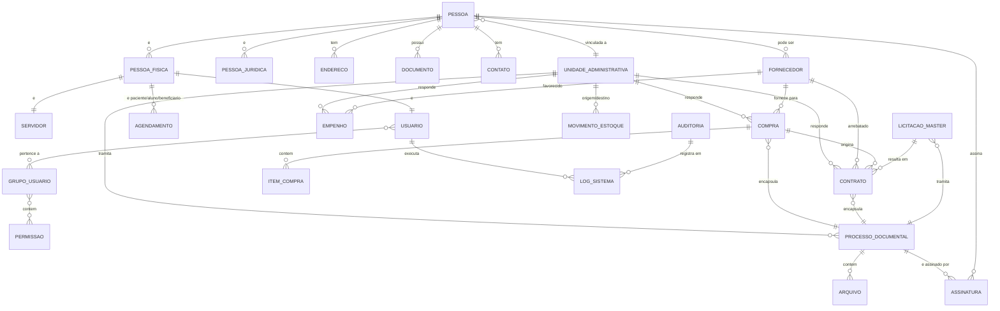

# Modelo Conceitual

**Projeto:** SIGMUN – Sistema Integrado de Gestão Municipal

**Domínio:** Modelo de Dados

**Versão:** 1.0

**Status:** Vigente

**Classificação da Informação:** Pública

**Documento(s) Relacionado(s):**

- 000-CONSTITUICAO-DO-PROJETO-SIGMUN.md
- 005-Arquitetura-de-Dados.md
- 006-Cadastro-Unico-Municipal.md

---

Este documento corresponde ao **início da Fase 5 — Modelo de Dados** definida no `Plano-de-Trabalho.md`. Apresenta o **Modelo Conceitual Corporativo** do SIGMUN: o conjunto de entidades (conjuntos de fatos) e seus relacionamentos, independentemente de detalhes físicos de armazenamento.

> **Referência:** o modelo do domínio-piloto de Compras (`DOM-COMPRAS-001`) — citado na Fase 5 do Plano — serviu de *template* para as convenções aqui adotadas. Como ainda não está versionado em `99-Anexos/Estudos`, este modelo foi derivado da `005-Arquitetura-de-Dados.md`, dos módulos em `src/modules/sigmun_*` e do mapa de domínios.

---

# 1. Objetivo

Definir, a nível corporativo, as entidades‑mestres, as transações e os documentos do modelo de dados do SIGMUN, garantindo a **"fonte única da verdade"** e o **"dado único"** estabelecidos pela Arquitetura de Dados (§ 3.2 e 3.3).

---

# 2. Escopo e Organização por Domínios

O banco `sigmun` (PostgreSQL) será particionado por **domínios responsáveis**. Quatro esquemas centrais (`core.*`) são compartilhados por todos os domínios; cada módulo `sigmun_*` possui seu próprio esquema:

```
sigmun
│
├── core                       -> esquemas centrais (compartilhados)
│   ├── pessoas                -> PESSOA, PESSOA_FISICA, PESSOA_JURIDICA,
│   │                            ENDERECO, DOCUMENTO, CONTATO
│   ├── usuarios               -> USUARIO, GRUPO_USUARIO, PERMISSAO
│   ├── documentos             -> PROCESSO_DOCUMENTAL, ARQUIVO, ASSINATURA
│   └── auditoria              -> AUDITORIA, LOG_SISTEMA
│
├── rh                        -> SERVIDOR, VINCULO, CARGO, FUNCAO, DEPENDENCIA
├── tributos                  -> LANCAMENTO_TRIBUTARIO, QUOTA, DEBITO, CREDITO
├── contabilidade             -> EMPENHO, DESPESA, RECEITA, CONTA_CONTABIL, RATEIO
├── compras                   -> COMPRA, ITEM_COMPRA, CONTRATO, LICITACAO
├── licitacoes                -> LICITACAO_MASTER, OBJETO, LANCE, HABILITACAO, ADITAMENTO
├── saude                     -> FICHA_ATENDIMENTO, AGENDAMENTO, PACIENTE, PRESCRICAO
├── educacao                  -> MATRICULA, TURMA, ALUNO, DISCIPLINA, BOLETIM
├── assistencia_social        -> FICHA_ATENDIMENTO_AS, BENEFICIO, PROGRAMA_SOCIAL
├── almoxarifado              -> ITEM_ESTOQUE, MOVIMENTO_ESTOQUE, CATEGORIA_ITEM
├── patrimonio                -> BEM, DEPRECIACAO, BAIXA_BEM, TRANSFERENCIA_BEM
├── frotas                    -> VEICULO, ABASTECIMENTO, MANUTENCAO, DESLOCAMENTO
├── obras                     -> OBRA, PLANTA, SERVICO_OBRA, INSPECAO_OBRA
├── ouvidoria                 -> PROTOCOLO, ATENDIMENTO, RECLAMACAO, RESPOSTA
├── transparencia             -> PUBLICACAO, LEI, COLUNA_FISCAL, COMPROVANTE_DESPESA
├── controladoria             -> INDICADOR, META, AVALIACAO, PERFIL_RISCO
├── planejamento              -> PLANO, OBJETIVO_ESTRATEGICO, ATIVIDADE_PLANO, CRONOGRAMA
├── procuradoria              -> PROCESSO_JUDICIAL, AUTUACAO, NOTIFICACAO, PECA_PROCESSUAL
├── gabinete                  -> ATAS, DISTRIBUICAO, POSICIONAMENTO
├── administracao             -> CONFIGURACAO, PARAMETRO, TABELA_AUXILIAR
├── agricultura               -> (entidades específicas)
└── financas                  -> (entidades específicas)
```

> **Notação:** nomes em `CAIXA_ALTA` denotam **entidade‑mestra** (compartilhada por mais de um domínio); os demais são transacionais e pertencem a um único esquema.

---

# 3. Entidades‑Mestres (Master Data)

## 3.1. Pessoa (única no município)

Única `PESSOA` por cidadão ou empresa; cidadãos, servidores e empresas externas compartilham o mesmo cadastro.

| Entidade | Esquema | Observação |
| -------- | ------- | ---------- |
| `PESSOA` | `core.pessoas` | PK `id` (UUID); `tipo` ∈ {FISICA, JURIDICA}; `categoria` ∈ {CIUDADAO, SERVIDOR, FORNECEDOR, AGENTE_EXTERNO}. |
| `PESSOA_FISICA` | `core.pessoas` | 1:1 com `PESSOA`; `data_nascimento`, `sexo`, `estado_civil`, `mae`, `pai`. |
| `PESSOA_JURIDICA` | `core.pessoas` | 1:1 com `PESSOA`; `razao_social`, `nome_fantasia`, `cnae_principal`, `capital`. |
| `ENDERECO` | `core.pessoas` | 1:N com `PESSOA`; histórico (`vigencia_inicio`, `vigencia_fim`). |
| `DOCUMENTO` | `core.pessoas` | 1:N com `PESSOA`; `tipo` (CPF, RG, CNPJ, CNH, PASSAPORTE…), `numero`, `orgao_emissor`, `data_emissao`, `data_validade`. |
| `CONTATO` | `core.pessoas` | 1:N com `PESSOA`; `tipo` (TEL, EMAIL, REDES, WHATSAPP), `valor`. |
| `FORNECEDOR` | `core.pessoas` | Perfil de `PESSOA_JURIDICA`; `situacao_cadastro`, `macro_categoria`. |

## 3.2. Unidade, Patrimônio e Mobiliário

| Entidade | Esquema | Observação |
| -------- | ------- | ---------- |
| `UNIDADE_ADMINISTRATIVA` | `core` | Órgão/unidade; hierarquia `unidade_pai`; `codigo_ibge`, `codigo_siafen`. |
| `SERVIDOR` | `rh` | 1:1 com `PESSOA_FISICA`; + `UNIDADE`; `matricula`, `data_admissao`, `data_desligamento`. |
| `VEICULO` | `frotas` | vinculado a `UNIDADE`; `placa`, `chassi`, `marca_modelo`. |
| `IMOVEL` | `administracao` | `matricula`, `setor`, `tipo`; histórico de localização. |
| `BEM` | `patrimonio` | bem móvel; `tombo`, `categoria`, `marca_modelo`; histórico. |

## 3.3. Identidade e Acesso

| Entidade | Esquema | Observação |
| -------- | ------- | ---------- |
| `USUARIO` | `core.usuarios` | 1:1 com `PESSOA`; `login` único, `senha_hash`, `mfa_secret`, `ultimo_login`. |
| `GRUPO_USUARIO` | `core.usuarios` | coleção de permissões. |
| `PERMISSAO` | `core.usuarios` | `chave_acesso` (ex.: `compras.compra.criar`). |

---

# 4. Transações Representativas (amostra transversal)

| Domínio | Transação | Relacionamentos |
| ------- | -------- | --------------- |
| `compras` | `COMPRA` | N `ITEM_COMPRA`; *para* `FORNECEDOR`; *por* `UNIDADE`; *em* `PROCESSO_DOCUMENTAL`. |
| `compras` | `CONTRATO` | *para* `FORNECEDOR`; *por* `UNIDADE`; *origem* `LICITACAO_MASTER`; *em* `PROCESSO_DOCUMENTAL`. |
| `contabilidade` | `EMPENHO` | *de* `PROCESSO_DOCUMENTAL`; *para* `FORNECEDOR`; *por* `UNIDADE`; origem `COMPRA`. |
| `tributos` | `LANCAMENTO_TRIBUTARIO` | *para* `PESSOA`; `debito`/`credito` em `CONTA_CONTABIL`; `historico`. |
| `rh` | `FICHA_FUNCIONAL` | *para* `SERVIDOR`; *em* `UNIDADE`; `vinculos` históricos. |
| `documentos` | `ARQUIVO` | anexo genérico; referenciado por `PROCESSO_DOCUMENTAL`, `COMPRA`, `EMPENHO`, `ATAS`. |
| `ouvidoria` | `PROTOCOLO` | *do* `PESSOA`; *por* `UNIDADE`; `categoria`, `status`, `prioridade`. |
| `almoxarifado` | `MOVIMENTO_ESTOQUE` | *de* `ITEM_ESTOQUE`; *entre* 2 `UNIDADE` (origem/destino); `tipo` ∈ {ENTRADA, SAIDA, AJUSTE}. |
| `saude`/`educacao`/`assistencia_social` | `AGENDAMENTO` | *para* `PESSOA_FISICA` (paciente/aluno/beneficiário); *por* `UNIDADE`. |
| `licitacoes` | `LICITACAO_MASTER` | *para* `OBJETO`; *por* `UNIDADE`; gera N `CONTRATO`. |

---

# 5. Regras de Relacionamento Corporativo

1. `UNIDADE_ADMINISTRATIVA` é a **parte responsável** de praticamente toda transação (COMPRA, EMPENHO, CONTRATO, PROCESSO_DOCUMENTAL, PROTOCOLO, MOVIMENTO_ESTOQUE…). Toda transação carrega `unidade_id` (não nula).
2. `PESSOA` é a **parte on‑screen** das transações: fornecedor (COMPRA, CONTRATO, EMPENHO), devedor (LANCAMENTO_TRIBUTARIO), cidadão/servidor/aluno/paciente/beneficiário (AGENDAMENTO, PROTOCOLO, FICHA_FUNCIONAL…).
3. `PROCESSO_DOCUMENTAL` (arquivo único) **encapsula** COMPRA, CONTRATO, EMPENHO e ATAS, garantindo número único de processo e tramitação.
4. `FORNECEDOR` ≈ `PESSOA` com `categoria=FORNECEDOR`; usado por COMPRA, CONTRATO e EMPENHO.
5. `DOCUMENTO` (CPF/CNPJ/RG/…) valida a identidade de `PESSOA` em assinaturas e contratos.
6. `USUARIO` atua por meio de `GRUPO_USUARIO`/`PERMISSAO`; toda ação transacional registra `created_by`/`updated_by` → `USUARIO`.
7. Todas as tabelas **críticas** carregam os **campos de auditoria padrão** (§ 9 da 005): `created_at`, `created_by`, `updated_at`, `updated_by`, `deleted_at`, `deleted_by`; e, quando versionável: `versao`, `vigencia_inicio`, `vigencia_fim`, `motivo_alteracao`.

---

# 6. Diagrama Conceitual (Mermaid)

Diagrama com foco nas **entidades‑mestres** e nas relações transversalmente compartilhadas. Transações secundárias de cada domínio estão na § 4.



---

# 7. Convenções Aplicáveis (derivadas da 005-Arquitetura-de-Dados.md)

| Regra | Aplicação |
| ----- | --------- |
| Identificador interno | UUID v4 (`id`) em **toda** entidade. |
| Identificadores externos | CPF, CNPJ, CNS, NIS, matrícula, códigos IBGE/INEP/CNES. |
| Nomenclatura | tabelas no plural, português, `snake_case`; chaves estrangeiras `*_id`. |
| Auditoria obrigatória | `created_at`, `created_by`, `updated_at`, `updated_by`, `deleted_at`, `deleted_by` em tabelas críticas. |
| Exclusão | **soft delete** (`deleted_at`), nunca físico em dados críticos. |
| Histórico | atributos versionáveis: `vigencia_inicio`, `vigencia_fim`, `motivo_alteracao`. |
| Dados sensíveis | saúde, familiares, documentos, socioassistência → criptografados e auditados (LGPD — Lei 13.709/2018). |

---

# 8. Mapeamento para os modelos seguintes

Este documento é insumo direto para:

- **Modelo Lógico** (`Modelo-Logico.md`): atributos, esquemas PostgreSQL, tipos (`uuid`, `text`, `timestamp`, `jsonb`).
- **MER / Diagramas ER** (`MER.md` + `Diagramas-ER/`): refinamento visual por esquema.
- **Modelo Físico** (`Modelo-Fisico.md`): DDL PostgreSQL, particionamento, índices, políticas de soft-delete.

> O padrão do piloto de Compras — entidade, atributo, chave, histórico e auditoria — foi replicado aqui a nível corporativo.

---

# 9. Versionamento

- 1.0 — 2026-08-19 — Início da modelagem conceitual corporativa (Fase 5), derivado da Arquitetura de Dados e dos módulos `src/modules/sigmun_*`.

---

**Documento:**Modelo-Conceitual.md
**Última atualização:** 2026-08-19
**Responsável:** Equipe SIGMUN
**Status da revisão:** Vigente
